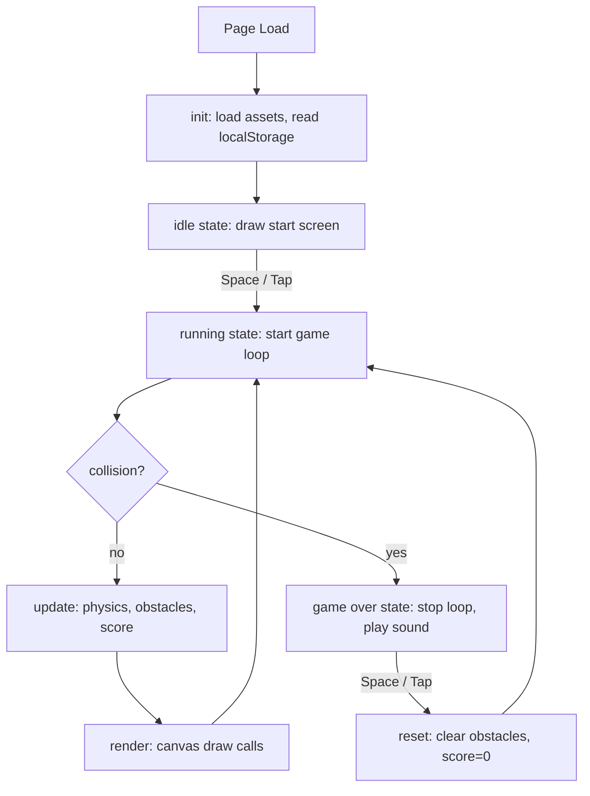

# Design Document: Frozen Kiro

## Overview

Frozen Kiro is a browser-based endless runner game delivered as two files: `index.html` (all game logic and rendering) and `config.js` (all tunable constants). The player controls a ghost sprite (ghosty.png) running along a snowy ground strip, jumping over procedurally generated ice crystal obstacles. The game uses the HTML5 Canvas API for all rendering, `requestAnimationFrame` for the game loop, and `localStorage` for high score persistence.

The implementation is intentionally minimal — no build step, no dependencies beyond a Google Fonts import for the retro pixel font. All game logic, rendering, and audio are handled in vanilla JavaScript. Constants are isolated in `config.js` so gameplay feel can be tuned without touching game logic.

### Reference UI

The score panel follows the classic endless runner format: `HI [high_score]  [current_score]` in the top-right corner, rendered in "Press Start 2P" font.

---

## Architecture

The game is structured as two files:

- `config.js` — all tunable constants, exported as a single `CONFIG` object
- `index.html` — game logic, rendering, and audio in an embedded `<script type="module">` block that imports `CONFIG`

Logical concerns are separated into clearly named functions and a small set of state objects, but there is no class hierarchy — just plain functions operating on shared state.



### Game States

| State | Description |
|---|---|
| `idle` | Initial state on page load. Runner visible, start prompt shown. |
| `running` | Active game loop. Physics, obstacle movement, scoring active. |
| `gameover` | Loop stopped. Game over overlay shown. Awaiting restart input. |

---

## Components and Interfaces

### Config Object (`config.js`)

All tunable constants live in a single exported object. Game logic reads from `CONFIG` exclusively — no magic numbers in `index.html`.

```js
// config.js
export const CONFIG = {
  // Physics
  gravity: 0.6,           // px/frame²
  jumpVelocity: -14,      // px/frame (negative = up)

  // Speed
  baseSpeed: 5,           // px/frame
  maxSpeedMultiplier: 3,  // cap at 3× base speed
  speedStepPercent: 0.05, // 5% increase per interval
  speedScoreInterval: 500,// score points between speed steps

  // Scoring
  scoreInterval: 6,       // frames per score point

  // Obstacles
  spawnMinMs: 1200,       // minimum spawn gap in ms
  spawnMaxMs: 2800,       // maximum spawn gap in ms

  // Layout
  groundRatio: 0.85,          // ground y as fraction of canvas height
  runnerHeightRatio: 0.12,    // runner height as fraction of canvas height
  runnerXRatio: 0.15,         // runner x as fraction of canvas width
};
```

### State Object

A single `state` object holds all mutable game data:

```js
const state = {
  phase: 'idle',       // 'idle' | 'running' | 'gameover'
  score: 0,
  highScore: 0,
  frameCount: 0,
  nextObstacleIn: 0,   // frames until next spawn
  obstacles: [],       // array of obstacle objects
  runner: {
    x: 0, y: 0,        // position (y = top of sprite)
    vy: 0,             // vertical velocity (px/frame)
    grounded: true,
  },
  speed: 0,            // current obstacle speed (px/frame)
};
```

### Constants

All constants are sourced from `CONFIG` (see `config.js` above). No magic numbers appear in game logic.

### Core Functions

| Function | Responsibility |
|---|---|
| `init()` | Load assets, read localStorage, set canvas size, attach event listeners, draw idle screen |
| `startRun()` | Transition to `running`, reset score/obstacles/runner, kick off game loop |
| `gameLoop(timestamp)` | `requestAnimationFrame` callback — calls `update()` then `render()` |
| `update()` | Advance physics, move obstacles, check collisions, increment score, schedule spawns |
| `render()` | Clear canvas, draw background, ground, runner, obstacles, score HUD |
| `jump()` | Apply `JUMP_VELOCITY` to runner if grounded; play jump.wav |
| `spawnObstacle()` | Push a new obstacle onto `state.obstacles`; schedule next spawn |
| `checkCollision()` | AABB test between runner hitbox and each obstacle hitbox |
| `triggerGameOver()` | Set phase to `gameover`, stop loop, update/persist high score, play game_over.wav |
| `resetGame()` | Clear obstacles, reset runner, score, frameCount; call `startRun()` |
| `handleResize()` | Resize canvas to viewport, recompute all proportional positions |
| `computeSpeed(score)` | Pure function: returns clamped speed for a given score |
| `formatScore(hi, score)` | Pure function: returns `"HI " + hi + "  " + score` |

### Audio Engine

A lightweight wrapper around the HTML `Audio` API:

```js
const audio = {
  jump: new Audio('assets/jump.wav'),
  gameOver: new Audio('assets/game_over.wav'),
  play(sound) {
    sound.currentTime = 0;
    sound.play().catch(() => {}); // silently swallow autoplay errors
  }
};
```

Autoplay policy compliance is handled by the `.catch(() => {})` — if the browser blocks playback before user interaction, the error is swallowed and playback is not attempted again until the next user-triggered event (which will already be a valid interaction context).

---

## Data Models

### Obstacle

```js
{
  x: number,       // left edge position
  y: number,       // top edge position (groundY - height)
  width: number,   // randomized between small/large variant
  height: number,
  variant: 'small' | 'large',
}
```

Two variants exist for visual variety. Both sit flush on the ground strip.

### Runner

```js
{
  x: number,       // fixed horizontal position (~15% of canvas width)
  y: number,       // top edge of sprite
  vy: number,      // vertical velocity
  grounded: boolean,
  width: number,   // derived from sprite aspect ratio
  height: number,  // RUNNER_HEIGHT_RATIO * canvas.height
}
```

### Score Display

Formatted by `formatScore(hi, score)` → `"HI 00042  00007"` (zero-padded to 5 digits).

---

## Correctness Properties

*A property is a characteristic or behavior that should hold true across all valid executions of a system — essentially, a formal statement about what the system should do. Properties serve as the bridge between human-readable specifications and machine-verifiable correctness guarantees.*

### Property 1: High score localStorage round-trip

*For any* non-negative integer stored in localStorage under the high score key, initializing the game should load and display that exact value.

**Validates: Requirements 1.5**

### Property 2: Gravity accumulation

*For any* runner in an airborne state with initial vertical velocity `vy0`, after `N` frames of physics update (without landing), the runner's vertical velocity should equal `vy0 + N * GRAVITY`.

**Validates: Requirements 2.3**

### Property 3: Landing resets vertical state

*For any* jump with any initial upward velocity, once the runner's computed y-position reaches or exceeds the ground level, the runner's `vy` should be set to 0 and `y` should equal `groundY`.

**Validates: Requirements 2.4**

### Property 4: Jump input idempotence while airborne

*For any* airborne runner state, applying jump input N additional times should leave `vy` unchanged from its value after the first jump was applied.

**Validates: Requirements 2.5**

### Property 5: Spawn interval is within bounds

*For any* generated spawn interval value, it should be greater than or equal to 1200ms and less than or equal to 2800ms.

**Validates: Requirements 3.1**

### Property 6: Obstacle moves left at constant speed

*For any* obstacle with initial x-position `x0` and current speed `s`, after `N` frames of update, the obstacle's x-position should equal `x0 - s * N`.

**Validates: Requirements 3.3**

### Property 7: Off-screen obstacles are removed

*For any* set of obstacles after an update step, no obstacle remaining in the active list should have its right edge fully past the left edge of the canvas (i.e., `x < -obstacle.width`).

**Validates: Requirements 3.4**

### Property 8: Speed scaling formula

*For any* score value `s >= 0`, `computeSpeed(s)` should return a value in the range `[BASE_SPEED, BASE_SPEED * MAX_SPEED_MULTIPLIER]` and equal `min(BASE_SPEED * (1 + floor(s / 500) * SPEED_STEP), BASE_SPEED * MAX_SPEED_MULTIPLIER)`.

**Validates: Requirements 3.5**

### Property 9: Collision detection correctness

*For any* runner hitbox and obstacle hitbox that overlap (AABB intersection), `checkCollision()` should return `true`; for any pair that do not overlap, it should return `false`.

**Validates: Requirements 4.1**

### Property 10: High score persistence on game over

*For any* current score that exceeds the stored high score, after `triggerGameOver()` is called, `localStorage` should contain the new score as the high score.

**Validates: Requirements 4.5**

### Property 11: Score increments at correct rate

*For any* number of frames `N` elapsed during a run, the score should equal `Math.floor(N / SCORE_INTERVAL)`.

**Validates: Requirements 5.1**

### Property 12: Score resets to zero on new run

*For any* score value at the time of game over, after `resetGame()` is called and a new run begins, `state.score` should equal 0.

**Validates: Requirements 5.3**

### Property 13: Score display format

*For any* high score `hi` and current score `s`, `formatScore(hi, s)` should return a string matching `"HI " + zeroPad(hi) + "  " + zeroPad(s)`.

**Validates: Requirements 5.4**

### Property 14: Obstacles cleared on restart

*For any* number of active obstacles at game over, after `resetGame()` is called, `state.obstacles` should be an empty array.

**Validates: Requirements 8.3**

### Property 15: High score retained across restart

*For any* high score value, after `resetGame()` is called, `state.highScore` should equal the same value as before the reset.

**Validates: Requirements 8.4**

### Property 16: Canvas fills viewport on resize

*For any* new viewport dimensions `(w, h)`, after the resize handler fires, `canvas.width` should equal `w` and `canvas.height` should equal `h`, and the ground y-position should equal `h * GROUND_RATIO`.

**Validates: Requirements 9.2**

---

## Property Reflection

Reviewing for redundancy:

- Properties 12 and 14 both test reset behavior but cover different state fields (score vs obstacles) — both are kept.
- Properties 2 and 3 both relate to jump physics but test different phases (airborne accumulation vs landing) — both are kept.
- Property 9 (collision detection) subsumes any specific positional example — kept as the single collision property.
- Properties 10 and 1 both involve localStorage but test different operations (write on game over vs read on init) — both are kept as they form a full round-trip together.

No redundancies found that warrant consolidation.

---

## Error Handling

| Scenario | Handling |
|---|---|
| `localStorage` unavailable (private browsing, quota exceeded) | Wrap read/write in `try/catch`; default high score to 0 |
| Audio playback blocked by autoplay policy | `.catch(() => {})` on `play()` promise; no retry needed since next interaction will be a valid context |
| `ghosty.png` fails to load | `Image.onerror` falls back to drawing a filled rectangle as the runner |
| Window resize during game over | Resize handler still fires; positions recomputed correctly since they derive from canvas dimensions |
| Negative or NaN score | Score is only incremented by integer addition from 0; cannot go negative under normal operation |

---

## Testing Strategy

### Unit Tests (example-based)

Focus on concrete behavior and edge cases:

- Idle state renders start prompt text
- Space key in idle state transitions to running
- Space key in game over state triggers restart
- Touch event in game over state triggers restart
- Audio engine calls `play()` with correct file on jump
- Audio engine calls `play()` with correct file on game over
- Spawned obstacle y-position equals `groundY - obstacle.height`
- Game over overlay renders correct text strings
- Score display uses correct font

### Property-Based Tests

Use [fast-check](https://github.com/dubzzz/fast-check) (JavaScript PBT library). Each test runs a minimum of 100 iterations.

Tag format: `// Feature: frozen-kiro, Property N: <property_text>`

Properties to implement as PBT:

| Property | fast-check Arbitraries |
|---|---|
| P1: localStorage round-trip | `fc.nat()` for high score value |
| P2: Gravity accumulation | `fc.float({ min: -20, max: 0 })` for vy0, `fc.nat({ max: 120 })` for N |
| P3: Landing resets vertical state | `fc.float({ min: -20, max: -1 })` for initial vy |
| P4: Jump idempotence | `fc.nat({ max: 10 })` for extra jump attempts |
| P5: Spawn interval bounds | `fc.nat({ max: 1000 })` as seed for interval generator |
| P6: Obstacle moves left | `fc.float({ min: 100, max: 1000 })` for x0, `fc.nat({ max: 200 })` for N |
| P7: Off-screen removal | `fc.array(fc.record({ x: fc.float({ min: -200, max: 1000 }) }))` |
| P8: Speed scaling formula | `fc.nat({ max: 10000 })` for score |
| P9: Collision detection | `fc.record(...)` for overlapping and non-overlapping hitbox pairs |
| P10: High score persistence | `fc.nat()` for score, `fc.nat()` for previous high score |
| P11: Score rate | `fc.nat({ max: 3600 })` for frame count |
| P12: Score reset | `fc.nat({ max: 99999 })` for pre-reset score |
| P13: Score format | `fc.nat({ max: 99999 })` for hi and score |
| P14: Obstacles cleared | `fc.array(fc.record(...))` for obstacle list |
| P15: High score retained | `fc.nat()` for high score value |
| P16: Canvas resize | `fc.nat({ min: 320, max: 3840 })` for width, `fc.nat({ min: 240, max: 2160 })` for height |

### Integration / Smoke Tests

- Canvas dimensions match `window.innerWidth` × `window.innerHeight` on load
- Canvas background is `#000000`
- Font is set to `"Press Start 2P"` in score render calls
- Audio files resolve at `assets/jump.wav` and `assets/game_over.wav`
